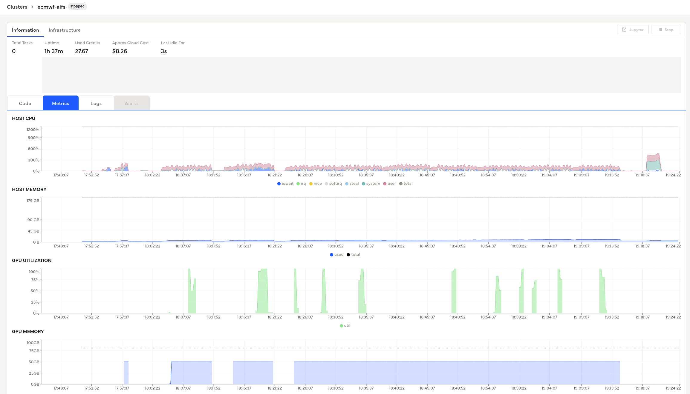
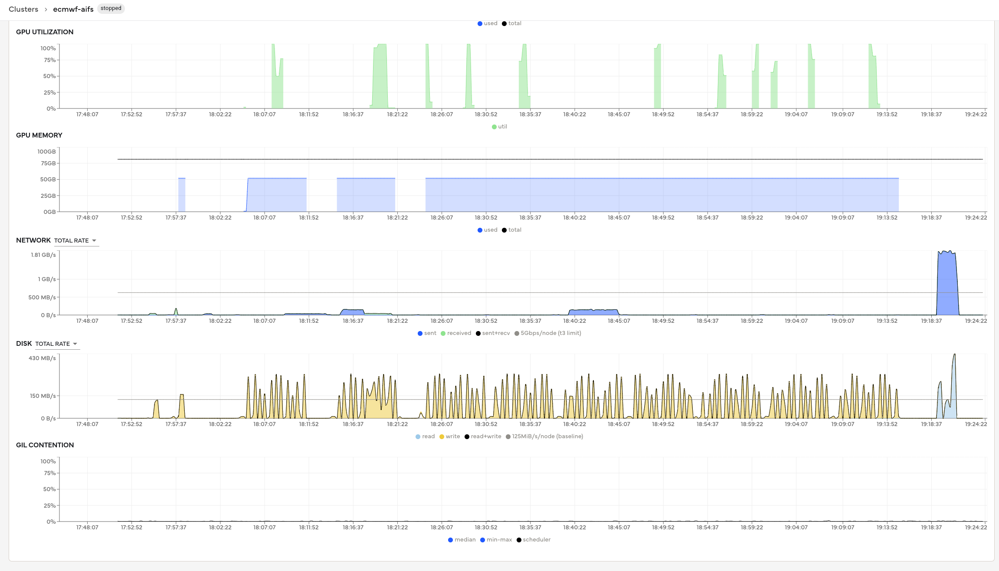

# Coiled GPU Inference Guide for AIFS Ensemble v1.0

This guide provides comprehensive instructions for running AIFS ensemble forecasting using Coiled notebooks with GPU acceleration, including cost analysis and optimization strategies.

## Table of Contents
- [Overview](#overview)
- [Coiled Environment Setup](#coiled-environment-setup)
- [GPU Instance Commands](#gpu-instance-commands)
- [ETL Instance Commands](#etl-instance-commands)
- [Performance Analysis](#performance-analysis)
- [Cost Implications](#cost-implications)
- [Optimization Opportunities](#optimization-opportunities)

## Overview

AIFS (Artificial Intelligence Forecasting System) ensemble v1.0 requires significant computational resources for weather forecasting. This document details how to leverage Google Cloud's powerful GPU instances through Coiled to run ensemble members efficiently.

## Coiled Environment Setup

The project uses two distinct Coiled software environments:

1. **GPU Environment**: `flashattn-dockerv1` - Optimized for GPU inference with FlashAttention (~16GB Docker image)
2. **ETL Environment**: `aifs-etl-v2` - Lightweight environment for data processing tasks

Both environments are installed through Docker files and environment configurations located in the `env/` directory.

**Important**: Docker images should be stored in the same region (europe-west4) as compute resources to avoid container registry cross-region transfer charges. The flashattn-dockerv1 image is ~16GB and incurs significant costs when pulled across regions.

## GPU Instance Commands

### Primary GPU Inference Setup
```bash
coiled notebook start \
  --name ecmwf-aifs \
  --vm-type a2-ultragpu-1g \
  --software flashattn-dockerv1 \
  --workspace geosfm \
  --region europe-west4
```

**Instance Specifications:**
- **VM Type**: `a2-ultragpu-1g`
- **GPU**: NVIDIA A100 (1x 40GB HBM2)
- **CPU**: 12 vCPUs
- **Memory**: 85GB RAM
- **Region**: europe-west4 (Belgium)

## ETL Instance Commands

### Data Processing & Non-GPU Tasks
```bash
coiled notebook start \
  --name ea-aifs-etla1 \
  --vm-type n2-standard-2 \
  --software aifs-etl-v2 \
  --workspace geosfm \
  --region europe-west4
```

**Instance Specifications:**
- **VM Type**: `n2-standard-2`
- **CPU**: 2 vCPUs
- **Memory**: 8GB RAM
- **Cost**: Significantly lower than GPU instances

## Performance Analysis

### GPU Utilization Patterns



The monitoring dashboard reveals key performance characteristics:

#### System Metrics (9 Ensemble Member Run):
- **Runtime**: 1h 37m (5,820 seconds)
- **Used Credits**: 2767
- **Approx Cloud Cost**: $8.26
- **GPU Utilization**: Peak 100%, intermittent bursts
- **GPU Memory**: ~50GB sustained usage (out of 40GB available)
- **Host CPU**: Low utilization (~25% peaks)
- **Host Memory**: ~179GB total capacity

#### Additional Metrics:


- **Network I/O**: Peak 1.81 GB/s during data transfer
- **Disk I/O**: High activity during GRIB file generation (~430 MB/s peaks)

### Processing Performance (From Log Analysis)

Based on the actual run logs (`logs/run.txt`):

#### Per-Member Statistics:
- **Average Processing Time**: ~443 seconds per member
- **Total Data Generated**: ~15.35 GB per member (792-hour forecast)
- **File Output**: 11 GRIB files per member
- **Processing Rate**: ~99 GRIB fields per second

#### Full Ensemble Run:
- **9 Members Processed**: Successfully completed
- **Total Runtime**: 51.7 minutes
- **Total Data Generated**: 107.48 GB (104.97 GB)
- **Files Created**: 99 GRIB files
- **Disk Usage**: 39% of 369GB scratch space

#### Error Analysis:
- **Member 10 Failure**: "No space left on device" error
- **Root Cause**: Overlay filesystem (38GB) reached 98% capacity
- **Solution**: Use scratch disk (/dev/nvme0n1) with 369GB capacity

## Cost Implications

### GPU Instance Costs (a2-ultragpu-1g)

Based on the monitoring data:

| Metric | Value | Notes |
|--------|-------|-------|
| **Runtime** | 1h 37m | For 9 ensemble members |
| **Credits Used** | 2,767 | Coiled billing units |
| **Estimated Cost** | $8.26 | Approximate cloud cost |
| **Cost per Member** | ~$0.92 | Average per ensemble member |
| **Cost per Hour** | ~$5.08 | Sustained GPU usage |

### Cost Breakdown:
- **Compute**: A100 GPU @ ~$3-4/hour
- **Storage**: High-performance SSD
- **Network**: Data transfer costs
- **Container Registry**: Docker image pulls (16GB flashattn-dockerv1 image)
- **Management**: Coiled orchestration overhead

### Regional Cost Optimization:
- **Container Registry**: Keep Docker images in same region (europe-west4) to avoid cross-region transfer charges
- **GCS Buckets**: Use europe-west4 buckets for faster upload/download and reduced network costs
- **Compute Resources**: All resources in europe-west4 minimize data egress charges

### ETL Instance Costs (n2-standard-2)

Significantly lower costs for data preparation and post-processing:
- **Estimated Cost**: ~$0.10-0.20/hour
- **Use Case**: Data preprocessing, analysis, visualization

## Optimization Opportunities

### 1. GPU Utilization Efficiency

**Current State**: 
- GPU utilization shows burst patterns rather than sustained 100%
- Indicates potential for parallel processing

**Optimization Strategy**:
```bash
# Run multiple ensemble members in parallel
# Requires memory management and batch scheduling
python multi_run_AIFS_ENS_v1.py --parallel-members 2
```

### 2. Storage Optimization

**Current Issues**:
- Overlay filesystem exhaustion (38GB limit)
- Inefficient use of scratch space (369GB available)

**Solutions**:
- Direct output to scratch disk: `/scratch/ensemble_outputs/`
- Implement streaming GRIB compression
- Use incremental file cleanup

### 3. Memory Management

**Current State**:
- 50GB GPU memory usage sustained
- Host memory underutilized (~179GB available)

**Optimization**:
- Implement model sharding for larger ensembles
- Use gradient checkpointing to reduce memory footprint
- Cache initial conditions in host memory

### 4. Cost Reduction Strategies

**Preemptible Instances**:
```bash
coiled notebook start \
  --name ecmwf-aifs-preemptible \
  --vm-type a2-ultragpu-1g \
  --software flashattn-dockerv1 \
  --workspace geosfm \
  --region europe-west4 \
  --preemptible
```
- **Potential Savings**: 60-80% cost reduction
- **Risk**: Interruption during long runs

**Auto-scaling Configuration**:
- Scale down during data transfer phases
- Scale up only during active inference
- Use mixed instance types for different processing stages

### 5. Parallel Processing Implementation

**Current Sequential Processing**:
```python
# Current: One member at a time
for member in range(1, n_members+1):
    process_ensemble_member(member)
```

**Proposed Parallel Processing**:
```python
# Optimized: Batch processing
from concurrent.futures import ThreadPoolExecutor

def process_batch(member_batch):
    with ThreadPoolExecutor(max_workers=2) as executor:
        futures = [executor.submit(process_ensemble_member, m) for m in member_batch]
        return [f.result() for f in futures]
```

### 6. Future Optimization Targets

1. **Model Quantization**: Reduce precision for inference speed
2. **Mixed Precision**: FP16/FP32 hybrid approach
3. **Pipeline Parallelism**: Overlap computation and I/O
4. **Regional Optimization**: Multi-region deployment for global forecasts

## Best Practices

1. **Always use scratch disk** for large file outputs
2. **Monitor GPU utilization** in real-time using Coiled dashboard
3. **Set up automatic cleanup** of temporary files
4. **Use preemptible instances** for development and testing
5. **Profile memory usage** before scaling to larger ensembles
6. **Implement checkpointing** for long-running forecasts
7. **Regional Resource Alignment**:
   - Keep Docker images in europe-west4 Container Registry
   - Use GCS buckets in europe-west4 region
   - Deploy all compute resources in europe-west4
   - Minimize cross-region data transfer costs

## Troubleshooting

### Common Issues:

1. **Disk Space Errors**: 
   - Ensure outputs go to `/scratch/` not `/workspace/`
   - Monitor overlay filesystem usage

2. **GPU Out of Memory**:
   - Reduce batch size
   - Enable gradient checkpointing
   - Use model sharding

3. **Network Timeouts**:
   - Implement retry logic for ECMWF data retrieval
   - Use local caching for repeated runs

4. **High Data Transfer Costs**:
   - Verify all resources are in europe-west4 region
   - Check Container Registry location for Docker images
   - Ensure GCS buckets are regionally aligned

## Next Steps

1. Implement parallel ensemble processing for 2-3x speedup
2. Optimize storage usage patterns to reduce costs
3. Experiment with preemptible instances for cost savings
4. Develop automated scaling based on ensemble size
5. Create benchmarking suite for different instance types

---

*For questions or support, refer to the Coiled documentation or contact the development team.*